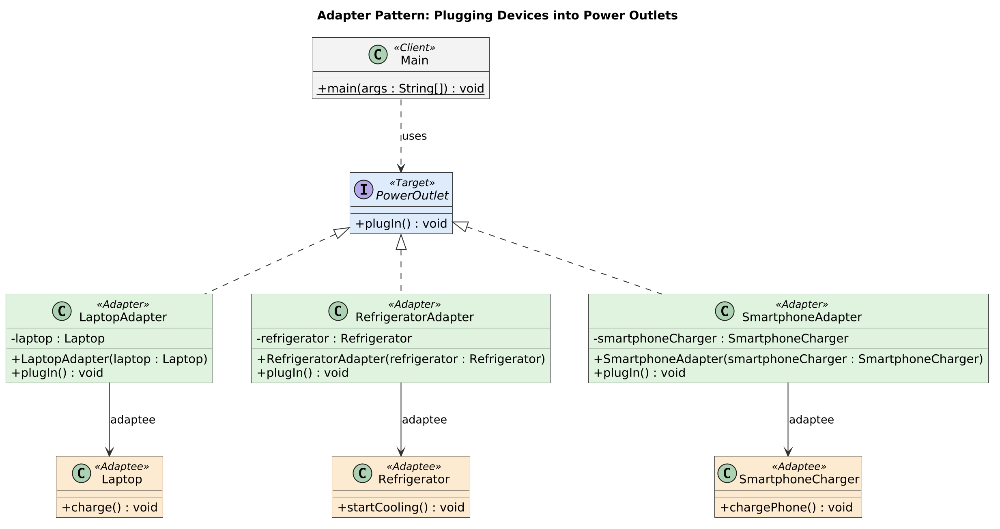

# Plugging Devices into Power Outlets

Adapter design pattern implemented in Java.

## Problem Statement

**Plugging Devices into Power Outlets**

You are developing an application that helps users manage and control various electronic devices by plugging them into power outlets. Each device has different plug types, voltage, and amperage requirements. To ensure compatibility and safety, you need to create adapters for different devices to allow them to be plugged into standard power outlets.

* **Adaptee Objects:**
  * **Laptop** - Represents a laptop device that needs to be plugged into a power source. It has the `charge()` method.
  * **Refrigerator** - Represents a refrigerator device that requires a power source. It has the `startCooling()` method.
  * **SmartphoneCharger** - Represents a smartphone charger that needs to be plugged in for charging. It has the `chargePhone()` method.
* **Target Object:**
  * **PowerOutlet** - Represents a standard power outlet with a common interface for plugging in devices. It defines the `plugIn()` method as the target method.
* **Adapter Objects:**
  * **LaptopAdapter** - An adapter for plugging a laptop into a standard power outlet. It adapts the `Laptop` to the `PowerOutlet` interface, translating `plugIn()` to `charge()`.
  * **RefrigeratorAdapter** - An adapter for plugging a refrigerator into a standard power outlet. It adapts the `Refrigerator` to the `PowerOutlet` interface, translating `plugIn()` to `startCooling()`.
  * **SmartphoneAdapter** - An adapter for plugging a smartphone charger into a standard power outlet. It adapts the `SmartphoneCharger` to the `PowerOutlet` interface, translating `plugIn()` to `chargePhone()`.

## UML Class Diagram



The diagram is also available as [SVG](uml/class-diagram.svg), and the editable PlantUML source is in [`uml/class-diagram.puml`](uml/class-diagram.puml).

## Solution Overview

The solution uses the **Object Adapter** form of the Adapter pattern. Each adapter implements the `PowerOutlet` (target) interface and holds a reference to the device (adaptee) it wraps, forwarding `plugIn()` to that device's own method. The client (`Main`) only ever talks to `PowerOutlet`, so every device is plugged in the same way.

| Pattern role | Class | Responsibility |
| --- | --- | --- |
| Target | `PowerOutlet` | Common interface that defines `plugIn()` |
| Adaptee | `Laptop`, `Refrigerator`, `SmartphoneCharger` | Existing devices whose methods (`charge()`, `startCooling()`, `chargePhone()`) do not match `PowerOutlet` |
| Adapter | `LaptopAdapter`, `RefrigeratorAdapter`, `SmartphoneAdapter` | Implement `PowerOutlet` and translate `plugIn()` into the wrapped device's method |
| Client | `Main` | Plugs devices in through the `PowerOutlet` interface only |

| Adapter | Wraps | `plugIn()` is translated to |
| --- | --- | --- |
| `LaptopAdapter` | `Laptop` | `charge()` |
| `RefrigeratorAdapter` | `Refrigerator` | `startCooling()` |
| `SmartphoneAdapter` | `SmartphoneCharger` | `chargePhone()` |

Composition is used instead of inheritance (a "class adapter") so that each adapter stays decoupled from the device's implementation and can wrap any instance of it.

## Project Structure

```
adapter-pattern-power-outlets/
├── README.md
├── .gitignore
├── src/
│   ├── PowerOutlet.java
│   ├── Laptop.java
│   ├── Refrigerator.java
│   ├── SmartphoneCharger.java
│   ├── LaptopAdapter.java
│   ├── RefrigeratorAdapter.java
│   ├── SmartphoneAdapter.java
│   └── Main.java
└── uml/
    ├── class-diagram.png
    ├── class-diagram.svg
    └── class-diagram.puml
```

## How to Compile and Run

Requires JDK 8 or later.

```bash
javac -d out src/*.java
java -cp out Main
```

## Sample Output

```
=== Plugging devices into power outlets ===

Plugging in: Laptop
Laptop is charging.

Plugging in: Refrigerator
Refrigerator has started cooling.

Plugging in: Smartphone Charger
Smartphone is charging.
```
